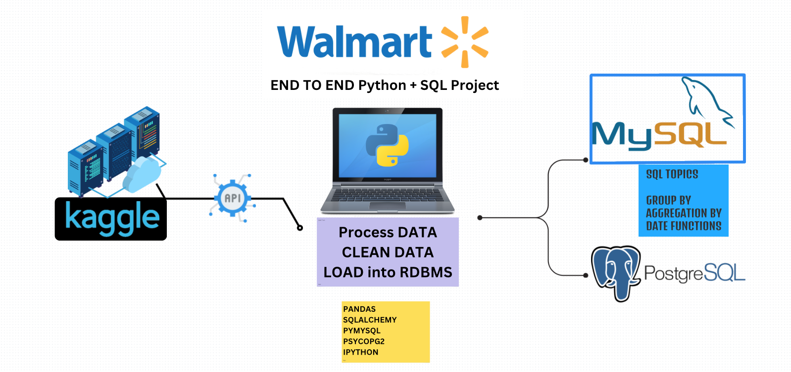

# Walmart Data Analysis: End-to-End SQL + Python Project 

## Project Overview



This project demonstrates a complete data analysis workflow using Walmart sales data with **nearly 10K rows after data cleaning**, showcasing advanced SQL querying, Python data manipulation, and end-to-end problem-solving techniques. Designed to extract critical business insights, it answers key business questions such as revenue trends, peak sales periods, and product performance. This project highlights my skills in data analysis, database management, and building reusable data pipelines.

## Key Highlights

End-to-End Data Workflow: Includes data collection, cleaning, feature engineering, SQL querying, and result documentation.
Database Expertise: Implements MySQL and PostgreSQL for data storage and querying.
Business Insights: Provides actionable insights on sales trends, customer behavior, and profit margins.
Technical Proficiency: Leverages Python and SQL for advanced data manipulation and analysis.

---

## Project Workflow

### 1. Environment Setup
   - **Tools Used**: Visual Studio Code (VS Code), Jupyter notebook Python, SQL (MySQL and PostgreSQL).
   - **Objective:**  Set up a structured workspace for streamlined development and data handling.

### 2. Kaggle API Configuration

- Obtained Kaggle API credentials from [Kaggle](https://www.kaggle.com/) and configured the .kaggle folder to enable seamless dataset downloads.

- Used the kaggle datasets download command to fetch the Walmart dataset directly into the project.

### 3. Data Collection
   - **Data Source**: Used the Kaggle API to download the Walmart sales datasets from Kaggle.
   - **Dataset Link**: [Walmart Sales Dataset](https://www.kaggle.com/najir0123/walmart-10k-sales-datasets)

   - **Storage**: Saved the data in the `data/` folder for easy reference and access.

### 4. Data Loading and Exploration

   - **Libraries**: Installed Python libraries (pandas, numpy, sqlalchemy, etc.) to facilitate data analysis.
   - Conducted an initial exploratory analysis using .info(), .describe(), and .head() to understand data structure and identify potential issues.

### 5. Data Cleaning    
[View data cleaning process Here](notebooks/project.ipynb)

- Removed duplicates, handled missing values, and standardized data types.
- Cleaned and formatted currency columns for accurate financial analysis.
- Validated the cleaned data to ensure consistency and accuracy.
- Formatted all column names to lowercase with df.columns.str.lower() function.

### 6. Feature Engineering

- Added calculated columns such as Total Amount (quantity * unit_price) to streamline downstream analysis.
- Enhanced datasets with derived metrics to simplify SQL queries.

### 7. Database Integration

MySQL and PostgreSQL: Established database connections using sqlalchemy for data loading and querying.
Automated table creation and data insertion scripts for both databases.
Verified successful data loading by running initial queries.

### 8. SQL Analysis

Designed and excuted advanced SQL queries to uncover valuable business insights, including:

- Branch and Category Performance: Identified the top-performing branches and product categories, showing their impact on overall revenue.
- Revenue and Transaction Trends: Examined trends in revenue and transactions based on time, location, payment methods, and customer purchasing habits.
- Profitability Analysis: Assessed profit margins by branch, product category, and shift to help refine sales strategies.
- Customer Behavior Insights: Identified peak sales times, preferred payment methods, and high-value customers based on their spending and visit frequency.
** Advanced Data Exploration:
Analyzed correlations between quantities sold and revenue to understand sales dynamics.
- Tracked sales trends by shift (morning, afternoon, evening) for better operational planning.
- Monitored cumulative revenue growth by branch over time to aid in forecasting and strategic decision-making.
- Used pivot-style analysis to map out sales distribution across key product categories.
- Revenue Decline Analysis: Flagged branches showing significant revenue drops over time, enabling action to address underperformance.
Documented each query with clear goals, detailed methodologies, and actionable results to ensure insights were reproducible and practical."

[View full list of business questions Here](walmart_business_questions.pdf)

[View full list of queries in PSQL Here](sql_queries/psql_queries.sql)

[View full list of queries in MYSQL Here](sql_queries/mysql_queries.sql)

A few samples of some of the advanced queries performed: 

```sql
--Q.11 Categorize sales into 3 groups: Morning, Afternoon, Evening
-- Determine each of the 3 shifts and number of transaction count per each branch.

-- Categorize shifts into Morning, Afternoon, and Evening and calculate transactions count per branch and shift
-- Categorize shifts and count transactions, listing results from Morning to Evening
-- Categorize shifts in order as: Morning, Afternoon, and Evening using a subquery


WITH categorized_shifts AS (
    SELECT
        branch,  
        CASE 
            WHEN EXTRACT(HOUR FROM time::time) < 12 THEN 'Morning'
            WHEN EXTRACT(HOUR FROM time::time) BETWEEN 12 AND 17 THEN 'Afternoon'
            ELSE 'Evening'
        END AS shift,  -- Define shift categories
        invoice_id  -- Retain invoice ID for counting
    FROM walmart
)
SELECT
    branch,  
    shift,  -- Shift categories
    COUNT(invoice_id) AS transaction_count  -- Count transactions per branch and shift
FROM categorized_shifts
GROUP BY 
    branch, 
    shift  -- Group by branch and shift to calculate transaction count.
ORDER BY 
    branch,  -- Sort by branch
    CASE 
        WHEN shift = 'Morning' THEN 1  -- Morning first
        WHEN shift = 'Afternoon' THEN 2  -- Afternoon second
        ELSE 3  -- Evening last
    END, 
    COUNT(invoice_id) DESC;  -- Sort by transaction count in descending order within branch and shift order by:
	-- First Morning as 1, Second Afternoon as 2, lastly Evening as 3 respectively for each branch.

-- Q.12 Identify 5 branches with the highest decrease ratio in 2023 revenue compared to the year prior (2022).
-- Calculate the revenue decrease ratio (or percentage decrease) for branches with revenue decline between 2022 and 2023
-- Compare branch revenues between 2022 and 2023, showing top 5 branches with the largest revenue decline

-- Let's start with formatting of date for year extraction

SELECT *,
EXTRACT(YEAR FROM TO_DATE(date, 'DD/MM/YY')) as formated_date
FROM walmart

-------------------------------------------------

-- Calculate total revenue per branch for 2022

WITH revenue_2022 AS (
    SELECT 
        branch,  -- Branch identifier
        SUM(total) AS revenue  -- Total revenue for the branch in 2022
    FROM walmart
    WHERE EXTRACT(YEAR FROM TO_DATE(date, 'DD/MM/YY')) = 2022  -- Filter for transactions in 2022
    GROUP BY branch  -- Group by branch to calculate total revenue
),

-- Calculate total revenue per branch for 2023
revenue_2023 AS (
    SELECT 
        branch,  -- Branch identifier
        SUM(total) AS revenue  -- Total revenue for the branch in 2023
    FROM walmart
    WHERE EXTRACT(YEAR FROM TO_DATE(date, 'DD/MM/YY')) = 2023  -- Filter for transactions in 2023
    GROUP BY branch  -- Group by branch to calculate total revenue
)

-- Compare revenues and calculate revenue decrease ratio
SELECT 
    ls.branch,  -- Branch identifier
    ls.revenue AS last_year_revenue,  -- Revenue from 2022
    cs.revenue AS cr_year_revenue,  -- Revenue from 2023
    ROUND(
        ((ls.revenue - cs.revenue)::numeric / ls.revenue::numeric) * 100, 
        2
    ) AS rev_decrease_ratio  -- Percentage revenue decrease rounded to 2 decimal places
FROM revenue_2022 AS ls
JOIN revenue_2023 AS cs
    ON ls.branch = cs.branch  -- Join the two revenue tables on branch code.
WHERE 
    ls.revenue > cs.revenue  -- Only include branches with a revenue decrease
ORDER BY rev_decrease_ratio DESC  -- Sort by the largest revenue decrease
LIMIT 5;  -- Show the top 5 branches with the largest revenue decrease

-- Q.13 Determine of the top busiest 3 days per branch

--Query to Get the Top 3 Busiest Days per Branch: 
--use the RANK() or ROW_NUMBER() window function with a PARTITION BY clause, 
--ensuring each branch is treated independently while ranking days based on transaction counts.

WITH ranked_days AS (
    SELECT 
        branch,
        TO_CHAR(TO_DATE(date, 'DD/MM/YY'), 'Day') AS day_name,
        COUNT(*) AS num_transactions,
        RANK() OVER (PARTITION BY branch ORDER BY COUNT(*) DESC) AS rank
    FROM walmart
    GROUP BY branch, day_name
)
SELECT 
    branch,
    day_name AS busiest_day,
    num_transactions,
	rank
FROM ranked_days
WHERE rank <= 3
ORDER BY branch, rank;

-- Alternative is using ROW_NUMBER():
-- Which breaks ties by assigning ranks sequentially based on the order in which rows are encountered.
-- When the desired outcome is to ensure no ties and have exactly 3 days per branch, RANK() can be replaced
-- with ROW_NUMBER():

WITH ranked_days AS (
    SELECT 
        branch,
        TO_CHAR(TO_DATE(date, 'DD/MM/YY'), 'Day') AS day_name,
        COUNT(*) AS num_transactions,
        ROW_NUMBER() OVER (PARTITION BY branch ORDER BY COUNT(*) DESC) AS row_num
    FROM walmart
    GROUP BY branch, day_name
)
SELECT 
    branch,
    day_name AS busiest_day,
    num_transactions,
	row_num
FROM ranked_days
WHERE row_num <= 3
ORDER BY branch, row_num;

-- Q.13.2 What are the top 3 busiest days for each branch, 
-- where days with the same number of transactions share the same rank, 
-- but the ranking does not skip numbers?

WITH ranked_days AS (
    SELECT 
        branch,  -- Branch identifier
        TO_CHAR(TO_DATE(date, 'DD/MM/YY'), 'Day') AS day_name,  -- Extract and format day name
        COUNT(*) AS num_transactions,  -- Count transactions for each branch and day
        DENSE_RANK() OVER (
            PARTITION BY branch  -- Reset ranking for each branch
            ORDER BY COUNT(*) DESC  -- Rank days by transaction count in descending order
        ) AS rank  -- Dense ranking without skipping numbers for ties
    FROM walmart
    GROUP BY branch, day_name  -- Group by branch and day for aggregation
)
SELECT 
    branch,  
    day_name AS busiest_day,  
    num_transactions  -- Number of transactions for the day
FROM ranked_days
WHERE rank <= 3  -- Filter for the top 3 busiest days per branch
ORDER BY branch, rank;  -- Order by branch and rank for readability

-- Q.14 What is the revenue contribution percentage of each category to its respective branch?

WITH total_branch_revenue AS (
    SELECT branch, SUM(total) AS branch_revenue
    FROM walmart
    GROUP BY branch
)
SELECT 
    w.branch,
    w.category,
    ROUND(SUM(w.total::numeric), 0) AS category_revenue,
    ROUND((SUM(w.total)::numeric / t.branch_revenue::numeric) * 100, 1) AS revenue_percentage
FROM walmart w
JOIN total_branch_revenue t ON w.branch = t.branch
GROUP BY w.branch, 
	w.category, 
	t.branch_revenue
ORDER BY 
	branch, 
	revenue_percentage DESC;

-- Q.15 What are the top 3 categories contributing the most to total revenue in each branch?

WITH category_revenue AS (
    SELECT 
        branch, 
        category, 
        ROUND(SUM(total::numeric),0) AS total_revenue
    FROM walmart
    GROUP BY branch, category
)
SELECT *
FROM (
    SELECT 
        branch,
        category,
        total_revenue,
        RANK() OVER (PARTITION BY branch ORDER BY total_revenue DESC) AS rank
    FROM category_revenue
) ranked_categories
WHERE rank <= 3;
 
--Q.16 Question: What is the cumulative revenue for each branch, ordered by transaction date?
-- Window Function with Cumulative Totals

SELECT 
    branch,
    date,
    ROUND(
        SUM(total::numeric) OVER (
            PARTITION BY branch
            ORDER BY TO_DATE(date, 'DD/MM/YY')
        ),
        0
    ) AS cumulative_revenue
FROM walmart
ORDER BY branch, TO_DATE(date, 'DD/MM/YY');
--Demonstrates knowledge of SUM() as a window function.
--This query can be useful for tracking revenue trends over time within each branch.


--Q.17 What are the total sales for each category, displayed as columns for easier comparison?
--Use of Pivoting

SELECT 
    branch,
    ROUND(SUM(CASE WHEN category = 'Electronic accessories' THEN total::numeric ELSE 0 END), 0) AS electronics_sales,
    ROUND(SUM(CASE WHEN category = 'Sports and travel' THEN total::numeric ELSE 0 END), 0) AS grocery_sales,
    ROUND(SUM(CASE WHEN category = 'Health and beauty' THEN total::numeric ELSE 0 END), 0) AS clothing_sales
FROM walmart
GROUP BY branch;

--This simulates a pivot table in SQL and is great for cross-category comparisons in a concise format.
```
### 9. Publishing and Documentation

- Maintained detailed project documentation in Markdown and Jupyter Notebooks.
- Published the project on GitHub with structured folders, including scripts, notebooks, and the README file.

---

## Requirements

- **Python 3.8+**
- **SQL Databases**: MySQL, PostgreSQL
- **Python Libraries**:
  - `pandas`, `numpy`, `sqlalchemy`, `mysql-connector-python`, `psycopg2`
- **Kaggle API Key** (for data downloading)


## Project Structure

```plaintext
|-- data/                     # Raw data and transformed data
|-- sql_queries/              # SQL scripts for analysis and queries
|-- notebooks/                # Jupyter notebooks for Python analysis
|-- README.md                 # Project documentation
|-- requirements.txt          # List of required Python libraries
|-- main.py                   # Main script for loading, cleaning, and processing data
```
---

## Future Enhancements

Possible extensions to this project:
- Gather more data including product details for example, break down data into separate tables to use joins to query the information. 
- Generate an ERD to show relationships
- Integration with a dashboard tool (e.g., Power BI or Tableau) for interactive visualization.
- Additional data sources to enhance analysis depth.
- Automation of the data pipeline for real-time data ingestion and analysis.

---

## License

This project is licensed under the MIT License. 

---

## Acknowledgments

- **Data Source**: Kaggle’s Walmart Sales Dataset
- **Inspiration**: Walmart’s business case studies on sales and supply chain optimization.

---